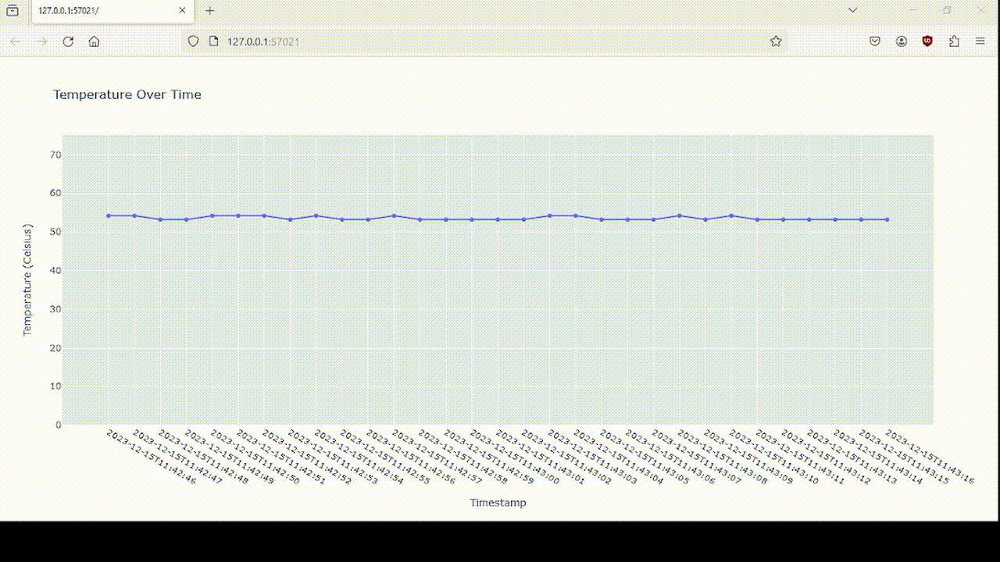

# Description
This repository serves as a proof-of-concept (POC) for an application that involves data acquisition and visualization of sensor measurements.


## Features:
- Firmware for the ESP32 device that includes BLE functionality using the ESP-IDF framework.
- Software written in Python for receiving data from the ESP32 device over BLE.
- Full application including the following steps: sensor data collection, BLE transmission, SQL database storage and data visualization.


# Instructions
Required hardware:
- ESP32-S3-DevKitC-1 development kit
- Notebook with BLE

1. Go to the software directory and install the python dependencies inside a virtual environment:
```
python3 -m venv .venv
source .venv/bin/activate
pip install -r requirements.txt
```

2. Turn on the ESP32 and activate the notebook's BLE

3. Run the python script with
```
python3 main.py
```

The interactive plot can be visualized inside a web browser:

